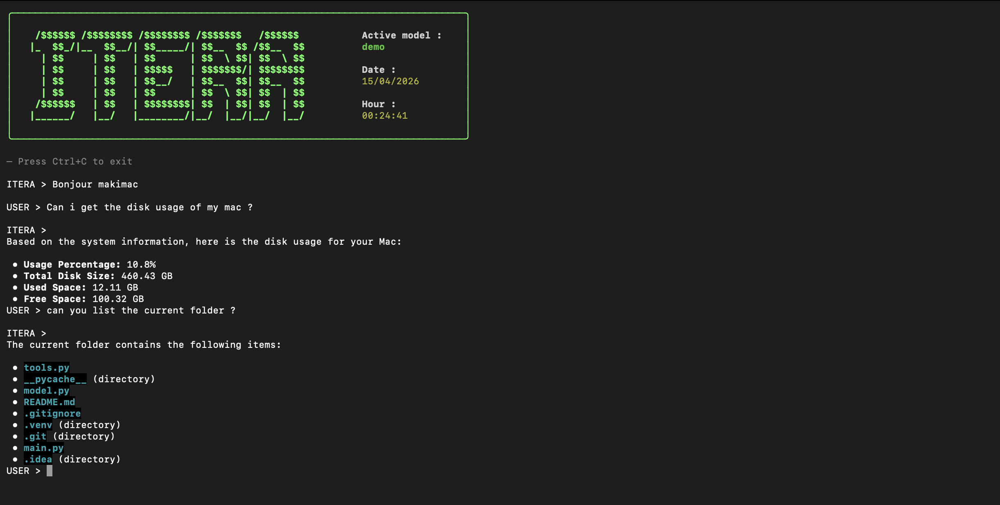

# ITERA

**Local CLI AI Agent powered by Ollama.**

ITERA is a lightweight terminal-based coding assistant. It combines the power of local LLMs with tool-calling capabilities for file operations, system inspection, and shell execution.

---

## Features

* **Local LLM Chat via Ollama**: Complete privacy without cloud dependencies.
* **Tool Calling System**: Autonomous agent reasoning and action capabilities.
* **File System Access**: Read, write, search, and explore files and directories.
* **System Monitoring**: Real-time CPU, RAM, disk, and battery statistics.
* **Shell Command Execution**: Run system commands directly from the chat.
* **Project Exploration**: Visual representation of project tree structures.
* **Streaming CLI Interface**: Fluid response rendering within the terminal.
* **CLI Model Selection**: Specify the model at launch using `--model`.
* **Persistent Memory**: Uses ChromaDB for vector-based long-term memory storage.

---

## Architecture

```text
Itera/
├── main.py                  # Entry point CLI
├── requirements.txt
├── README.md

├── assets/
│   └── Example_screen.png   # Examples / UI assets for README.md

├── chroma/                  # ChromaDB

├── itera/
│   ├── __init__.py
│   ├── agent.py             # Core agent (reasoning + tool calling loop)
│   ├── cli.py               # Interface CLI (input/output, streaming)
│   └── tools/
│       ├── __init__.py
│       ├── system.py        # CPU / RAM / battery / system info tools
│       ├── file_ops.py      # Read/write/search files + tree
│       ├── network.py       # Web/network tools
│       ├── environmental.py # (weather, air quality, etc...)
│       └── memory.py        # ChromaDB persistent memory layer
```

---

## Requirements

* Python 3.10+
* Ollama installed and running locally

### Install Dependencies

```bash
pip install ollama psutil rich
```

### Run

Start the CLI:

```bash
python main.py
```

Or using uv:

```bash
uv run main.py
```

Change the model using args : 
```bash
...  main.py --model yourmodel 
```


---

## Usage

Once started:

```bash
ITERA > Hi, how can I help you today ?
```

The assistant will process the request. To exit:

* `Ctrl + C`
* `/exit`
* `/bye`

---

## Available Tools

ITERA can dynamically invoke the following tools:

### File System
* `read_file(path)`
* `read_many_files(files)`
* `write_file(path, content)`
* `list_files(path)`
* `search_files(root, query)`

### System
* `system_info()`: Returns CPU, RAM, disk, and battery usage statistics.

### Shell
* `run_command(cmd)`: Executes system-level commands.

### Web Search

* `check_network(url)`: checks internet connectivity to a given URL
* `web_search_and_read(query, max_pages)`: performs a web search and extracts relevant information from top results

### Memory

* `get_memory(query, k)`: retrieves semantically relevant stored memories from ChromaDB
* `save_memory(text)`: stores information into persistent vector memory (ChromaDB) for long-term context retention


# Weather
* `get_place_infos(lat, lon)`: retrieves location-based information (weather, air quality etc...)

---

## Model Behavior

ITERA operates as a local agent following these steps:
1. The user provides an input.
2. The LLM determines if specific tools are required.
3. Tools are executed locally on the host machine.
4. The execution results are fed back into the model context.
5. A final response is generated for the user.

---

## Example



---

## Security Warning

The `run_command` tool executes shell commands directly on your system. Use this feature with caution and only within trusted environments.

---

## Tech Stack

* **Ollama**: Local LLM runtime.
* **Python**: Core programming language.
* **psutil**: System information retrieval.
* **rich**: Terminal UI rendering and formatting.
* **ChromaDB**: Vector database for persistent memory.

---

## Concept

ITERA is designed as a minimal, local alternative to tools like Claude Code or Gemini CLI, focusing on:
* Local execution and data sovereignty.
* Tool-augmented reasoning.
* Extensible agent architecture.
